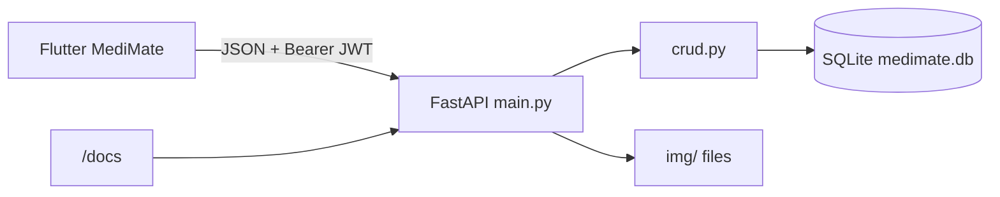
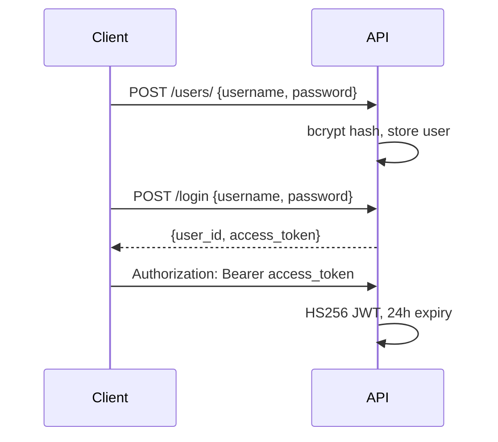
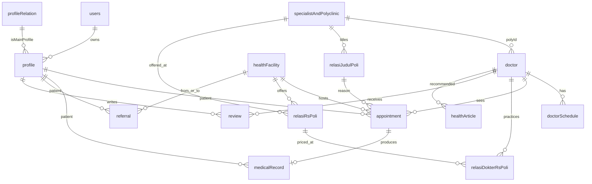
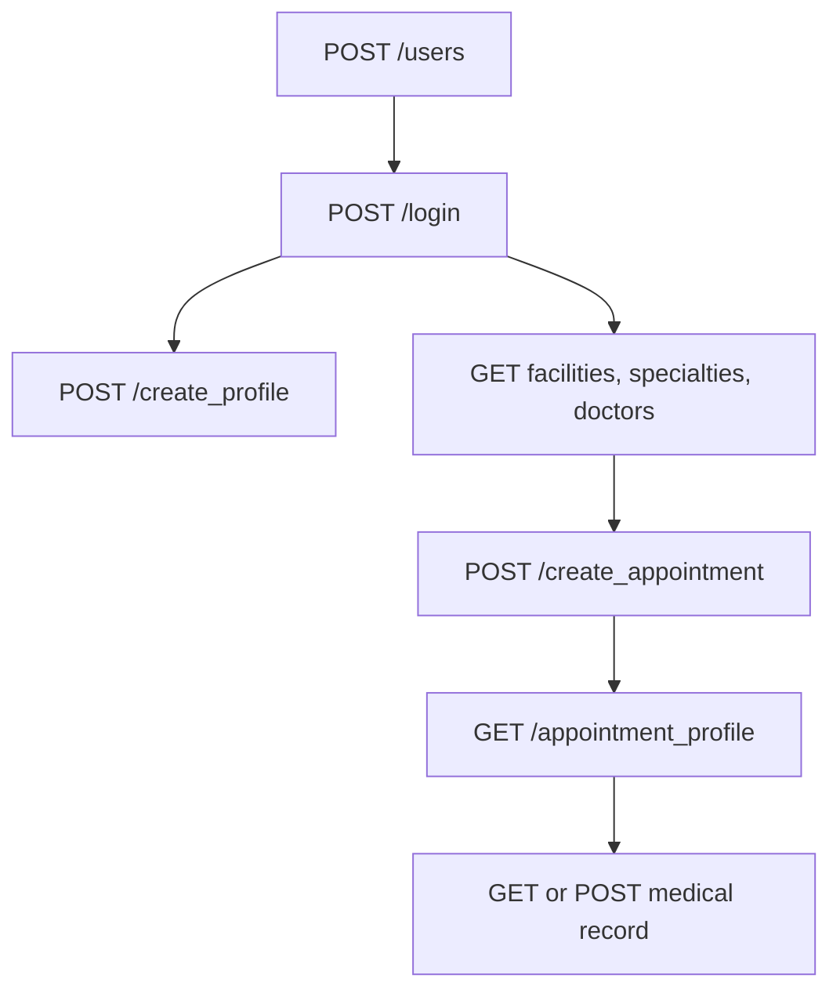

# MediMate Web Service

FastAPI backend for **MediMate**, the Tugas Besar Pemrograman Visual (Kelompok 1, 2024) healthcare app. It stores users, profiles, Bandung facilities, doctors, schedules, appointments, records, reviews, and referrals in SQLite, and serves the related images.

The Flutter client is [TubesProvisKel1](https://github.com/rakhargo/TubesProvisKel1). It calls this service at `http://127.0.0.1:8000`.

## Team

| Name | NIM |
| --- | --- |
| Rakha Dhifiargo Hariadi | 2209489 |
| Ahmad Taufiq Hidayat | 2202074 |
| Muhammad Rizki Revandi | 2205027 |
| Themy Sabri Syuhada | 2203903 |
| Muhammad Rafie Alhabsyi Setiawan | 2202400 |

## Architecture



| File | Role |
| --- | --- |
| `medimate/main.py` | Routes, JWT, image responses, CORS |
| `medimate/models.py` | SQLAlchemy tables |
| `medimate/schemas.py` | Pydantic request and response models |
| `medimate/crud.py` | Queries and bcrypt password hash |
| `medimate/database.py` | SQLite engine, `sqlite:///./medimate.db` |
| `medimate/medimate.db` | Seeded database, created next to the app module |
| `img/` | Photos and icons served by the image routes |

`rancangan_api.txt` is an early food-ordering sketch. It is not this API.

On startup, `models.BaseDB.metadata.create_all` creates any missing tables. CORS allows every origin, method, and header.

## Run

Python 3 with:

```text
fastapi  uvicorn  sqlalchemy  pydantic  bcrypt  python-jose  python-multipart
```

There is no `requirements.txt`. Install those packages, then:

```bash
cd medimate
uvicorn main:app --host 0.0.0.0 --port 8000 --reload
```

- API root: `http://127.0.0.1:8000/` returns a pointer to the docs.
- Interactive docs: `http://127.0.0.1:8000/docs`
- Swagger’s Authorize button uses `POST /token` (form username and password, OAuth2 password flow). The app itself uses `POST /login`.

The file comments also show a gunicorn form for a server:

```bash
gunicorn main:app --workers 4 --worker-class uvicorn.workers.UvicornWorker --bind 0.0.0.0:8000
```

Image routes resolve files from `../img` relative to `medimate/`, so run uvicorn from the `medimate` directory.

## Auth



- `POST /users/` and `POST /login` are public. Login body is the same shape as sign up: `username` and `password`.
- Login returns `user_id` and `access_token`. It does not return `token_type`.
- Protected routes use `Authorization: Bearer <access_token>`.
- `POST /token` is the Swagger helper. It returns `{access_token, token_type: "bearer"}`.
- Passwords are hashed with bcrypt before they are stored.
- A bad or expired token answers `401`. A duplicate username answers `400`.

## Data model

`profile.isMainProfile` points at `profileRelation.id`. Relation id `1` is `Main`. The app treats that as the account owner. Other relations: Father, Mother, Son, Daughter, Grandparents, Wife, Husband, Other.



Seeded `medimate.db` (approximate): 5 users, 5 profiles, 5 doctors, 6 schedules, 4 appointments, 4 medical records, 1 article, 1 review, 1 referral, 12 specialties, 1 service row.

Facilities in Kota Bandung: Mayapada, Santo Borromeus, Hasan Sadikin, Melinda, Muhammadiyah, Santosa, Klinik Jaya Abadi, Puskesmas Garuda.

Specialties: Cardiologist, Dentist, Dermatologist, Gynecologist, Immunogologist, Neurologist, Oncologist, Orthopedist, Otolaryngologist, Pediatric, Pulmonologist, Urologist.

Appointment `status` values the client uses are `ongoing` and `recent`.

## Endpoints

Unless marked public, send `Authorization: Bearer <token>`.

### Users

| Method | Path | Notes |
| --- | --- | --- |
| POST | `/users/` | Public. Create user. |
| POST | `/login` | Public. Returns `user_id` and `access_token`. |
| POST | `/token` | Public. Swagger OAuth2 form login. |
| GET | `/users/{user_id}` | User row, no password hash in the schema. |

### Profiles

| Method | Path | Notes |
| --- | --- | --- |
| POST | `/create_profile/{user_id}` | `user_id` must match `profile.userId`. |
| PUT | `/update_profile/{profile_id}` | |
| GET | `/profile_user_id/{user_id}` | All profiles for a user. |
| GET | `/profile/{profile_id}` | |
| DELETE | `/delete_profile/{profile_id}` | |
| GET | `/profile_picture/{profile_id}` | File from `img/profile_picture/`. |
| POST | `/upload_profile_picture/` | Query `profile_id` plus file. Updates `userPhoto`. |
| POST | `/upload_profile_image` | Public. Saves a file, returns `image_name`. |
| GET | `/profile_relation/` | Relation labels. |
| GET | `/profile_relation/{relation_id}` | |

Profile body: `nama`, `tanggalLahir` (`YYYY-MM-DD`), `jenisKelamin`, `alamat`, `email`, `noTelepon`, `userPhoto`, `userId`, `isMainProfile`.

### Doctors and schedules

| Method | Path | Notes |
| --- | --- | --- |
| GET | `/doctor/` | |
| GET | `/doctor_id/{doctor_id}` | |
| GET | `/doctor_poly_id/{poly_id}` | Doctors in one specialty. |
| GET | `/doctor_picture/{doctor_id}` | `img/doctor_picture/`. |
| GET | `/doctor_schedule/` | |
| GET | `/doctor_schedule_id/{id}` | |
| GET | `/doctor_schedule_doctor_id/{doctor_id}` | |
| POST | `/doctor_schedule/` | |
| PUT | `/doctor_schedule/{id}` | |

Schedule body: `tanggal`, `mulai`, `selesai`, `maxBooking`, `currentBooking`, `doctorId`.

### Booking

| Method | Path | Notes |
| --- | --- | --- |
| POST | `/create_appointment/` | Body below. |
| GET | `/appointment/{appointment_id}` | |
| GET | `/appointment_profile/{profile_id}` | |
| PUT | `/appointment_update/{appointment_id}` | |
| DELETE | `/delete_appointment/{appointment_id}` | |

Appointment body: `patientId`, `doctorId`, `facilityId`, `status`, `waktu`, `metodePembayaran`, `antrian`, `relasiJudulPoliId`.

### Facilities, specialties, services

| Method | Path | Notes |
| --- | --- | --- |
| GET | `/health_facility/` | |
| GET | `/health_facility_id/{facility_id}` | |
| GET | `/health_facility_picture/{id}` | `img/healthFacility/foto/`. |
| GET | `/health_facility_logo/{id}` | `img/healthFacility/logo/`. |
| GET | `/specialist_and_polyclinic/` | |
| GET | `/specialist_and_polyclinic/{id}` | |
| GET | `/specialist_and_polyclinic_images/{id}` | `img/specialist_and_polyclinic/`. |
| GET | `/services/` | |
| GET | `/service_images/{service_id}` | `img/service_icon/`. |

### Join tables

These link a facility, a specialty, a doctor, and a price or visit reason.

| Method | Path |
| --- | --- |
| GET | `/relasi_rs_poli/` |
| GET | `/relasi_rs_poli/{id}` |
| GET | `/relasi_rs_poli_rs_id/{rs_id}` |
| GET | `/relasi_rs_poli_id/{poly_id}` |
| GET | `/relasi_dokter_rs_poli/` |
| GET | `/relasi_dokter_rs_poli/{id}` |
| GET | `/relasi_dokter_rs_poli_doctor_id/{doctor_id}` |
| GET | `/relasi_dokter_rs_poli_relasirspoli_id/{id}` |
| GET | `/relasi_dokter_rs_poli_id_id/{relasirspoli_id}/{doctor_id}` |
| GET | `/relasi_judul_poli/` |
| GET | `/relasi_judul_poli/{id}` |
| GET | `/relasi_judul_poli_id/{poly_id}` |

`relasiDokterRsPoli.harga` is the consultation price. `relasiJudulPoli` holds `judul` and `tindakan` for a specialty.

### Records, articles, reviews, referrals

| Method | Path | Notes |
| --- | --- | --- |
| GET | `/medical_record/{id}` | |
| GET | `/medical_record_profile/{profile_id}` | |
| GET | `/medical_record_appointment/{appointment_id}` | |
| POST | `/create_medical_record/` | `patientId`, `date`, `appointmentId`, `relasiJudulPoliId`. |
| GET | `/health_article/` | |
| GET | `/health_article_id/{article_id}` | |
| GET | `/article_picture/{article_id}` | `img/article_picture/`. |
| POST | `/review/` | `reviewerId`, `revieweeDoctorId`, `revieweeFaskesId`, `rating`, `komentar`, `tanggal`. |
| GET | `/review_doctor/{doctor_id}` | |
| GET | `/review_facility/{facility_id}` | |
| POST | `/referral/{profile_id}` | |
| GET | `/referral/{referral_id}` | |

Referral body: `fromFacilityId`, `toFacilityId`, `patientId`, `tanggal`, `alasan`.

## Images

Routes look up the filename stored on the row. A missing file returns `404`.

```text
img/
  profile_picture/            user photos (dummy.png is the sign-up default)
  healthFacility/foto/        facility photos
  healthFacility/logo/        facility logos
  specialist_and_polyclinic/  specialty icons
  doctor_picture/             expected by GET /doctor_picture
  article_picture/            expected by GET /article_picture
  service_icon/               expected by GET /service_images
```

`img/images/` and `img/icons/` are extra assets (splash, articles, service art). The API image routes do not read those folders.

## Client flow this API supports


